# DuoCode: Class Diagram

This diagram illustrates the main classes in the DuoCode application, grouped by layers according to the layered architecture pattern.

```mermaid
classDiagram
    %% UI LAYER
    class UI_LAYER["User Interface Layer"]
    class MainActivity {
        +onCreate(savedInstance: Bundle)
    }
    UI_LAYER -- MainActivity
    
    %% DOMAIN LAYER
    class DOMAIN_LAYER["Domain/Business Logic Layer"]
    
    class AuthViewModel {
        -isLogin: Boolean
        +email: String
        +password: String
        +name: String
        -isLoading: Boolean
        +toggleAuthMode()
        +authenticate(context, onSuccess, onMessage)
    }

    class QuestMapViewModel {
        -topics: List~TopicInfo~
        -subtopics: List~SubtopicInfo~
        -userSubtopicsProgress: List~UserSubtopicProgress~
        -isLoading: Boolean
        -error: String?
        -fetchData()
    }

    class QuestionLoadingViewModel {
        -isLoading: Boolean
        -error: String?
        -questions: List~Question~
        -currentQuestionIndex: Int
        +correctAnswerCount: Int
        +totalQuizTimeSeconds: Long
        -questionStartTime: Long
        -lastQuestionCorrect: Boolean
        +loadQuestions(subtopicId)
        +onQuestionCompleted(isCorrect)
        +navigateToNextQuestion()
        +submitResult()
    }

    class ChallengesViewModel {
        -challenges: List~ChallengeData~
        -isLoading: Boolean
        -error: String?
        -userId: String
        -subtopicsMapping: Map
        +loadChallenges()
    }
    
    class AchievementsViewModel {
        -achievements: List~AchievementData~
        -isLoading: Boolean
        -error: String?
        -auth: FirebaseAuth
        -db: FirebaseFirestore
        +loadAchievements()
        +unlockAchievement(achievementId)
    }

    class ProfileViewModel {
        -user: User?
        -isLoading: Boolean
        -isUpdatingProfilePicture: Boolean
        -errorMessage: String?
        -auth: FirebaseAuth
        -db: FirebaseFirestore
        -loadUserData()
        -getUserDocRef(uid): DocumentReference?
    }

    class FriendViewModel {
        -friends: List~Friend~
        -pendingRequests: List~FriendRequest~
        -isLoading: Boolean
        -errorMessage: String?
        +searchEmail: String
        -searchResults: List~User~
        -isSearching: Boolean
        -auth: FirebaseAuth
        -db: FirebaseFirestore
        -loadFriends()
        -loadPendingRequests()
        +searchUsers()
        +sendFriendRequest(userId)
    }
    
    DOMAIN_LAYER -- AuthViewModel
    DOMAIN_LAYER -- QuestMapViewModel
    DOMAIN_LAYER -- QuestionLoadingViewModel
    DOMAIN_LAYER -- ChallengesViewModel
    DOMAIN_LAYER -- AchievementsViewModel
    DOMAIN_LAYER -- ProfileViewModel
    DOMAIN_LAYER -- FriendViewModel
    
    %% DATA LAYER
    class DATA_LAYER["Data/Model Layer"]
    
    class User {
        +uid: String
        +name: String
        +email: String
        +profilePictureUrl: String
    }

    class Topic {
        +id: String
        +name: String
        +order: Int
        +iconKey: String
    }

    class Subtopic {
        +id: String
        +name: String
        +order: Int
        +topicId: String
    }

    class UserSubtopicProgress {
        +id: String
        +completed: Boolean
        +correctAnswers: Int
    }

    class Question {
        +id: String
        +subtopicId: String
        +difficulty: String
        +questionType: String
        +description: String
    }

    class MultipleChoiceQuestion {
        +options: List~String~
        +correctAnswer: List~Int~
    }

    class DragAndDropQuestion {
        +options: List~String~
    }

    class Lesson {
        +id: String
        +description: String
        +topicId: String
        +imageUrl: String
    }

    class Friend {
        +id: String
        +uid: String
        +name: String
    }

    class FriendRequest {
        +id: String
        +senderId: String
        +receiverId: String
        +status: FriendRequestStatus
        +timestamp: Long
    }

    class Achievement {
        +id: String
        +title: String
        +description: String
    }

    class AchievementData {
        +id: String
        +title: String
        +description: String
        +iconName: String
        +unlocked: Boolean
        +dateUnlocked: Date?
    }
    
    DATA_LAYER -- User
    DATA_LAYER -- Topic
    DATA_LAYER -- Subtopic
    DATA_LAYER -- UserSubtopicProgress
    DATA_LAYER -- Question
    DATA_LAYER -- MultipleChoiceQuestion
    DATA_LAYER -- DragAndDropQuestion
    DATA_LAYER -- Lesson
    DATA_LAYER -- Friend
    DATA_LAYER -- FriendRequest
    DATA_LAYER -- Achievement
    DATA_LAYER -- AchievementData

    %% Relationships between classes
    MultipleChoiceQuestion --|> Question
    DragAndDropQuestion --|> Question
    
    QuestMapViewModel --> Topic : uses
    QuestMapViewModel --> Subtopic : uses
    QuestMapViewModel --> UserSubtopicProgress : uses
    
    QuestionLoadingViewModel --> Question : uses
    
    AuthViewModel --> User : creates
    ProfileViewModel --> User : updates
    
    FriendViewModel --> Friend : manages
    FriendViewModel --> FriendRequest : processes

    AchievementsViewModel --> AchievementData : manages
```

## Layer Description

### 1. User Interface Layer
The UI layer contains screen components, UI elements, and navigation logic. This layer interacts with the user and presents information.

### 2. Domain/Business Logic Layer
The domain layer contains ViewModels that manage UI state, business logic, and interactions with the data layer.

### 3. Data/Model Layer
The data layer defines the structure of application data through model classes. These models represent entities like User, Topic, Question, etc.

### 4. External Systems (not shown in class diagram)
The application interacts with external systems like Firebase Authentication and Firestore Database for data storage and user authentication.

## Key Patterns

1. **Model-View-ViewModel (MVVM)**: The application follows the MVVM pattern with:
   - Models representing data entities
   - Views implemented as Compose UI components
   - ViewModels managing UI state and business logic

2. **Repository Pattern**: While not explicitly implemented as separate repository classes, the ViewModels act as repositories by handling data operations with Firebase.

3. **Dependency Inversion**: The application components depend on abstractions rather than concrete implementations, allowing for better testability and maintainability. 