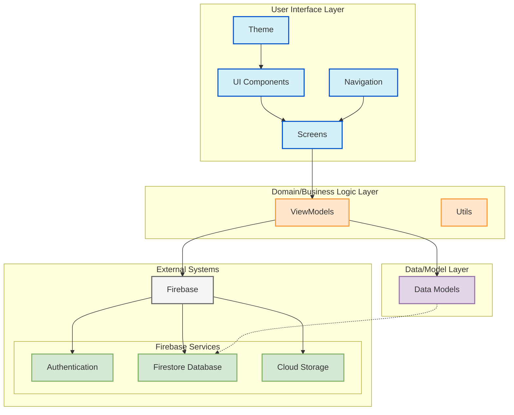

# DuoCode: High-Level Component Diagram

This diagram shows the high-level architecture of the DuoCode application, following a layered architecture pattern.

## Description

The DuoCode application follows a layered architecture with four main layers:

1. **User Interface Layer**: Contains all UI-related components, screens, navigation, and theming.
2. **Domain/Business Logic Layer**: Contains ViewModels that handle business logic and UI state.
3. **Data/Model Layer**: Contains data models that represent the application's entities.
4. **External Systems**: Contains Firebase services for authentication, database, and storage.

The architecture enforces separation of concerns where:
- UI components only interact with ViewModels
- ViewModels manage UI state and business logic
- Data Models define the structure of application data
- Firebase services handle data persistence and authentication 